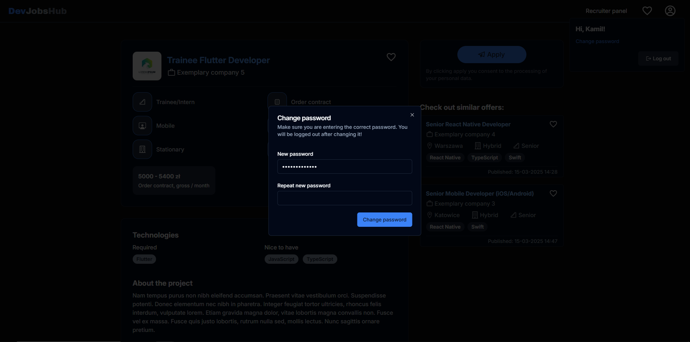

# DevJobsHub  💼📌 - screenshots are below

DevJobsHub is an application that allows recruiters to post job offers and comprehensively manage them. The recruiter can create their own recruitment surveys for candidates and can add other recruiters to manage the job offer.

## I encourage you to check out the application 💻

  <a href="https://www.devjobshub.pl/search?pageNumber=0&sortBy=dateTimeOfCreation&sortingDirection=asc" target="_blank">https://www.devjobshub.pl/</a>

## Tech Stack 🚀
**Backend:** Java, Spring Boot, PostgreSQL, Hibernate

**Frontend:** TypeScript, React, Tailwind, Redux, HTML, CSS

**Files storage (CV and company logotypes):** Amazon S3

**Deployment:** Azure Virtual Machine, Azure Database for PostgreSQL, Azure Static Web Apps
 
 

## Backend - significant features
### 1. Job Offer Management 💼

- **Creating job offers:** Recruiters can create new job offers by specifying:
  - Recruitment survey (single-choice, multiple-choice and open questions)
  - Company logotype (stored in Amazon S3)
  - Basic informations such as the title of the offer
  - Expiration date
  - Technological requirements
  - Job level
  - Operating mode
  - Salary details
  - Project description
  - Duties description
  - Benefits description
  - Requirements, responsibilities in bullet points
  - company address
- **Getting a presigned URL from Amazon S3 for CV or company logo so the frontend can upload files**
- **Recruiter can update job offer**
- **Recruiter can delete job offer**
- **Users can search for offers with filtering by various criteria (e.g. location, level of experience, technology)**
- **Users can add and remove offers from their favourites**
- **Managing recruiters assigned to offers:** After creating a job offer, a recruiter can add other recruiters to it so that they can manage the recruitment for the position.
 

### 2. Job Application Management 📝

- **Applying for offers:** Candidates can apply for job offers by attaching:
    - CV (stored in Amazon S3)
    - Answers to candidate survey questions (open, single-choice, multiple-choice questions)
- **Browse applications:** Recruiters can browse submitted applications.
- **Managing applications:** Recruiters can mark applications as favourites or rejected for easier management.
 

### 3. User Management 💻
- **User registration**
- **Login:** User login using email address and password
- **Updating profile data:** Users can update their personal information
- **Change password:** User can change password
 

### 4. Authentication & Security 🔐
- **JWT Authentication:** Users authenticate using JWT tokens
 

## Frontend - screenshots :camera: (currently there is only a desktop version)

## Authors

- [Kamil Jach](https://www.github.com/kamilos04)
